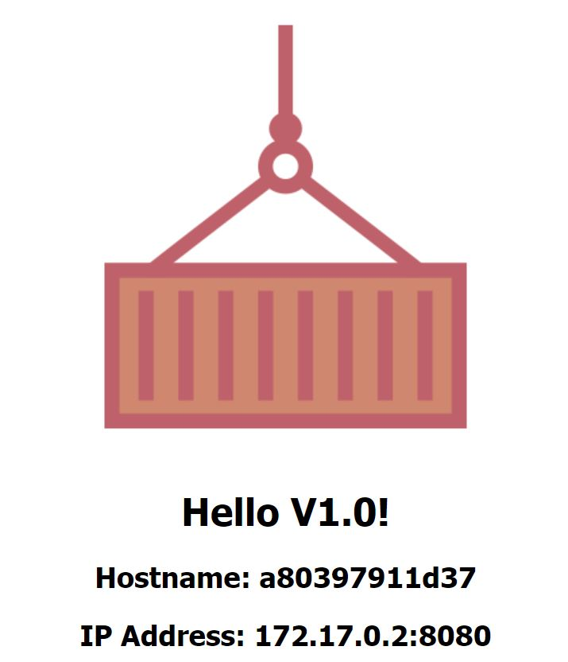
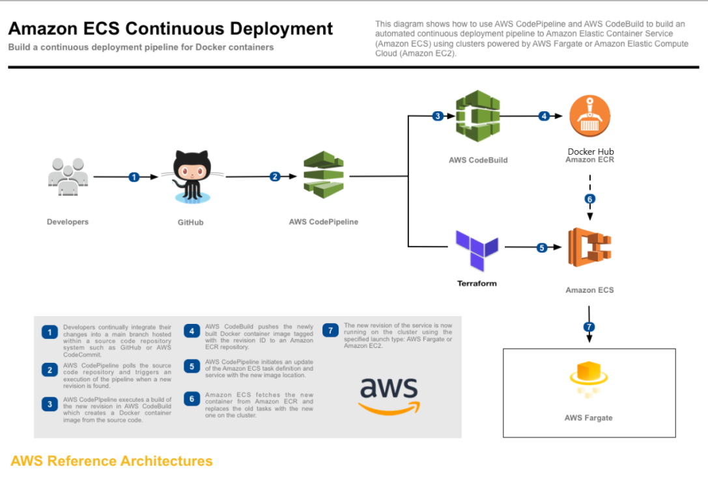

# Docker image with a static html frontpage
A simple docker image that can run either standalone or that can connect to a database.

# build
docker build -t blankia/hello-world:latest .

# run
winpty docker run -it  -p 8080:8080 blankia/hello-world:latest

winpty docker run -it  -p 8080:8080 --env COLOR=red blankia/hello-world:latest

# CI/CD 
You can plug in this project into the "ecs-app" or "k8s-app" CI/CD pipelines depicted here https://github.com/roeldenblanken/aws-terraform-code-pipeline-ci-cd-example

A full CI/CD example including infra and ecs app would look like below:

# Parameters
Accepts the following optional parameters

| Parameter | Description |
| ------------- | ------------- |
| COLOR  | What color the picture of the container on the static html page is (red, blue, black).   |
| NODE_NAME  | Add 'Node Name' to static HTML page if NODE_NAME has been set.  |
| DB_ENDPOINT  | The connection url for the database.  |
| DB_USER  | The user to login to the database.  |
| DB_PASSWORD  | The password of the database user.  |
| DB_BASE  | The database name. |
| DB_PORT  | The database port. |

# Requirements

Requires the following secure parameters to be present in the AWS SSM Parameter store when you want to plug it into the CI/CD pipeline.

| Parameter | Description |
| ------------- | ------------- |
| docker_username  | The docker repo username  |
| docker_password  | The docker repo password  |

	